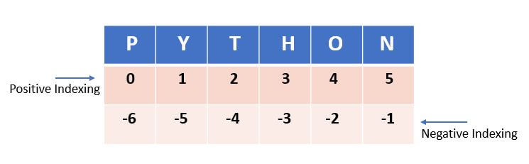

What is a list
---------------

A list is an ordered sequence of items. The list index starts from zero.

- Whenever we try to access an item with an index more than the Lists length, it will throw the 'Index Error'

- Similarly, the index values are always an integer. If we give any other type, then it will throw Type Error.

- Negative Indexing
-  The elements in the list can be accessed from right to left by using negative indexing. The negative value starts from -1 to -length of the list. It indicates that the list is indexed from the reverse/backward.

1. [decl.py] How to create a list
2. How to add elements on the list
3. How to modify a list
4. How to delete elements of a list

-> Orderdered list: Maintain the order of the data insertion.
-> Changeable: List is mutable and we can modify items.
-> Heterogeneous: List can contain data of different types.
-> Contains duplcate: allows duplicate data.

## The following are the properties of a list.

1. Mutable: The elements of the list can be modified. We can add or remove items to the list after it has been created.
2. Ordered: The items in the lists are ordered. Each item has a unique index value. The new items will be added to the end of the list.
3. Heterogenous: The list can contain different kinds of elements i.e; they can contain elements of string, integer, boolean, or any type.
4. Duplicates: The list can contain duplicates i.e., lists can have two items with the same values.

## The list data structure is very flexible It has many unique inbuilt functionalities like pop(), append(), etc which makes it easier, where the data keeps changing.

# https://pynative.com/python-lists/

# List indexing

